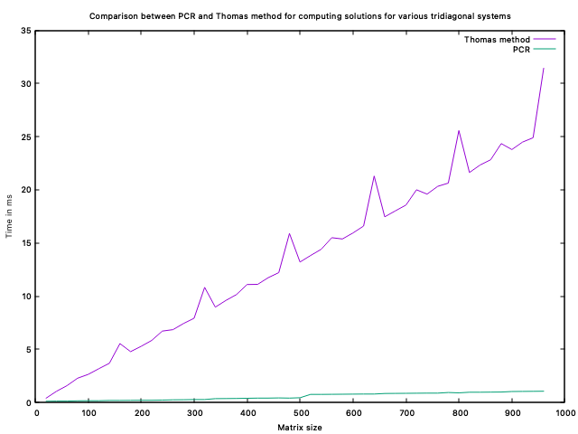
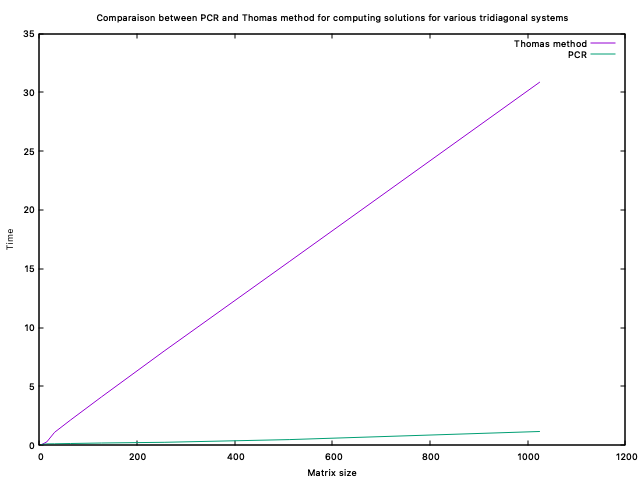

# PDE simulation of bullet options
## _Supervised by Professor Lokmane Abbas Turki_

The goal of this project is to develop a deeper understanding of Partial Differential Equations (PDE) through the practical application of simulating bullet options. We aim to implement and critically analyze two different algorithms – the Thomas algorithm and Parallel Cyclic Reduction (PCR) – to solve tridiagonal systems. This simulation, based on the Crank-Nicolson scheme, will allow us to explore the nuances of these methods and their effectiveness in a financial context, specifically in the pricing of options.


## Files and implemented functions
- pde.cu : first implementation of Thomas' algorithm and the PCR on 2 simple examples (one commented), this allows us to see that the algorithm does actually work before implementing it on more matrices
- pde_finalQ1.cu : second implementation on more randomely generated cases and also speed measurment
- pde_finalQ2.cu : second exercise
- pde_finalQ3.cu : third exercise
- timing_data2.txt : comparison values for Thomas' algorithm and PCR
- Sujets2023-2.pdf : full subject, our implementation focuses on part 3
- commandes.txt : execution commands for gnuplot

## Run the program

This program was made for a GPU environment. If you do not have access to a GPU, you can use https://colab.research.google.com/?hl=fr and before running the program select T4 GPU.

Here is how to run the program (on Google Colab) : 
```c
!nvcc -o <file_name> <file_name>.cu
!./file_name
```

## To run gnuplot for algorithm analysis

Install gnuplot

```sh
brew install gnuplot
```
```sh
gnuplot -p < commandes.txt
```

## Analysis

In our analysis we decided to look at randomely generated fixed size systems and varied the number of tridiagonal systems we were going to solve at the same time. As such, we varied the number of systems (from 20 to 1024, the maximum number of threads).
Here is a representation of our results :



Here we can see that Thomas' algorithm is in O(n) and the PCR is in O(log(n)). 
The curve for Thomas' algorithm has a few irregularities which can be smoothed out by picking values of power 2. The method is illustrated here :


